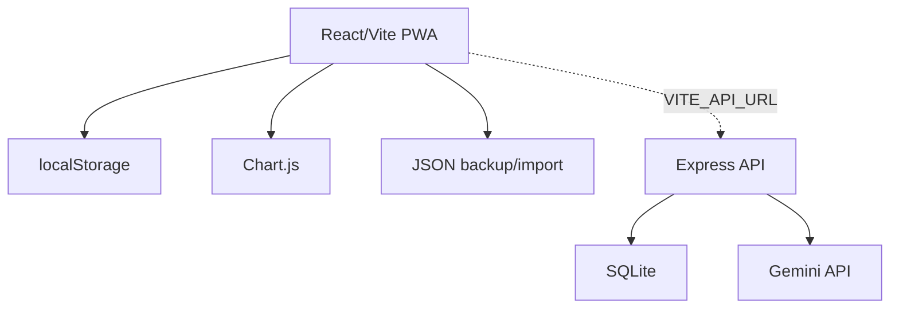

# PowerGraph arhitektura

PowerGraph je lokalno-prva fitness PWA aplikacija. Osnovni nacin delovanja je brez serverja: uporabnik se prijavi lokalno, podatki pa se shranjujejo v `localStorage`. Ce je nastavljen backend, aplikacija dodatno podpira JWT prijavo, SQLite sync, admin pregled in varen Gemini proxy za AI funkcije.

## Cilj aplikacije

- Hiter vnos treningov z vajami, seti, tezo, komentarji in zgodovino.
- Sledenje kalorijam, makrom, telesni tezi, rest dnevom, cheat dnevom in vodi.
- Pregled napredka s statistikami, grafi, heatmapom in rang sistemom.
- JSON backup/import za prenos med napravami.
- Opcijski backend sync brez izpostavljanja API kljucev v frontend bundle.

## Frontend

- `src/App.jsx` vsebuje trenutno glavno aplikacijsko logiko.
- `src/styles.css` vsebuje responsive layout, PWA/mobile prilagoditve in komponente.
- `src/utils/migrations.js` vsebuje varno branje/parsing, `DATA_SCHEMA_VERSION` in migracije za starejse lokalne podatke.
- `src/utils/nutrition.js` in `src/utils/fitness.js` vsebujeta izracune za dashboard, makrote, tedenske treninge in trend telesne teze.
- `src/services/api.js`, `src/services/sync.js` in `src/services/storage.js` locujejo backend klice, sync snapshot in skupne storage helperje.
- `public/sw.js` skrbi za cache aplikacije in obvestilo o novi verziji.
- `public/manifest.json` definira PWA instalacijo.

Glavna shramba:

- `powergraph_users`
- `powergraph_session`
- `powergraph_workouts_<email>`
- `powergraph_calories_<email>`
- `powergraph_bodyweight_<email>`
- `powergraph_rest_<email>`
- `powergraph_cheat_<email>`
- `powergraph_custom_ex_<email>`
- `powergraph_settings_<email>`

## Backend

Backend je v `backend/server.js`.

Funkcije:

- JWT registracija/prijava.
- SQLite tabele za uporabnike, treninge, kalorije, telesno tezo, zgodovino kalorimetra, rest/cheat dneve, ratings in login loge.
- `GET /api/sync` za prenos server podatkov v frontend.
- `POST /api/sync` za snapshot sync lokalnega stanja v SQLite.
- `POST /api/gemini` kot proxy, da `GEMINI_KEY` ostane na serverju.
- Admin endpointi za uporabnike in prijave.

## Sync pravila

- Frontend je vir takojšnje resnice: vsaka sprememba se takoj zapise v `localStorage`.
- Ce obstajata `VITE_API_URL` in JWT, frontend po kratkem zamiku poslje snapshot na `/api/sync`.
- Ob prijavi frontend najprej poskusi potegniti backend podatke in jih zdruzi z lokalnimi.
- JSON export/import ostane fallback in rocni backup.

## Varnost

- Frontend ne sme vsebovati `VITE_GITHUB_TOKEN` ali `VITE_GEMINI_KEY`.
- Skrivnosti so v `backend/.env`, ki ne sme biti commitan.
- SQLite datoteke so runtime podatki in niso del izvorne kode.
- Lokalna prijava v browser-only nacinu ni prava kriptografsko varna avtentikacija med napravami; namenjena je locevanju lokalnih profilov.
- Import JSON backupa mora najprej prikazati preview in sele nato zamenjati lokalne podatke.
- Brisanje lokalnih podatkov zahteva dodatni vpis `DELETE`.
- Ce brskalnik blokira `localStorage`, aplikacija prikaze opozorilo, ker lokalni podatki morda ne bodo shranjeni.

## Roadmap

1. Nadaljevati postopno razbijanje `src/App.jsx` na feature module: auth, workouts, calories, progress, admin, AI.
2. Uporabljati `SMOKE_TEST.md` za build, backup/import, mobile in osnovni sync flow.
3. Razmisliti o IndexedDB, ce lokalni podatki prerastejo `localStorage`.
4. Dodati server endpoint za custom vaje, ce sync custom vaj postane zahteva.
5. Urediti migracijo git zgodovine, ce so bile skrivnosti ali baze ze commitane.
